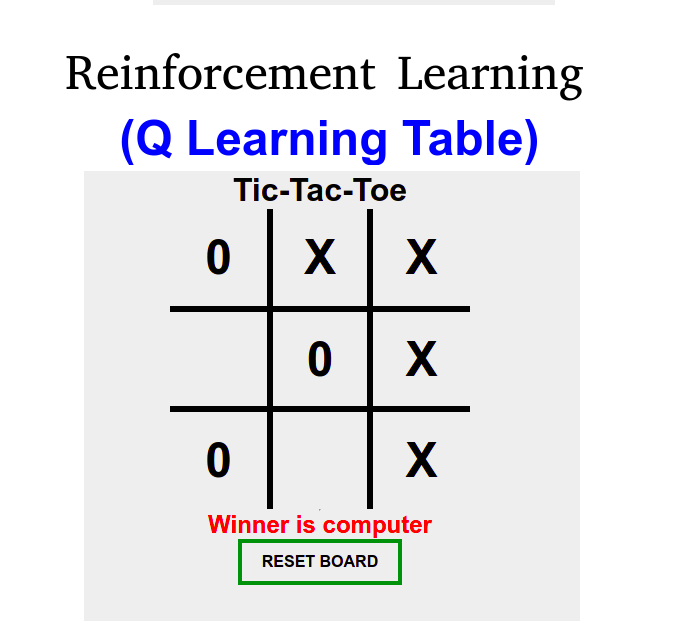
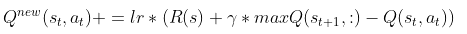
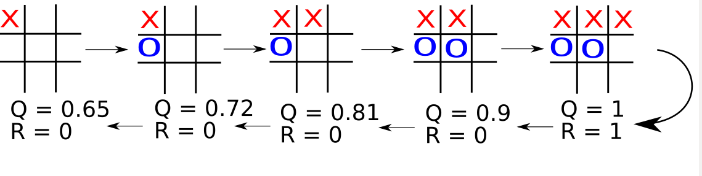

# Using Q-Learning to Learn How To Play Tic-Tac-Toe



[Tic-Tac-Toe Game](https://tictactoereinforcementlearning.herokuapp.com/)

## Overview
This project follows the description of the Q Learning table described in Playing Tic-Tac-Toe with Reinforcement Learning.

## Installation Dependencies:
* Python 2.7 or 3
* Flask 1.1.2
* pandas 1.1.5 

## What is Q learning?
Q-learning is a model-free reinforcement learning algorithm to learn the value of an action in a particular state. It does not require a model of the environment (hence "model-free"), and it can handle problems with stochastic transitions and rewards without requiring adaptations.

The core of the algorithm is a Bellman equation as a simple value iteration update, using the weighted average of the old value and the new information:



## How the algorithm work

The tic-tac-toe game presents a concept a little different from other models, as the reward comes only at the end of the game. Then it must be analyzed backwards, using the final result (tie, victory or defeat) as a reference. To simplify the explanation, see below an example for the following configured values.

```
lr = 1.0 ( learning rate )
gamma = 0.9 ( Factor Discont)
```


